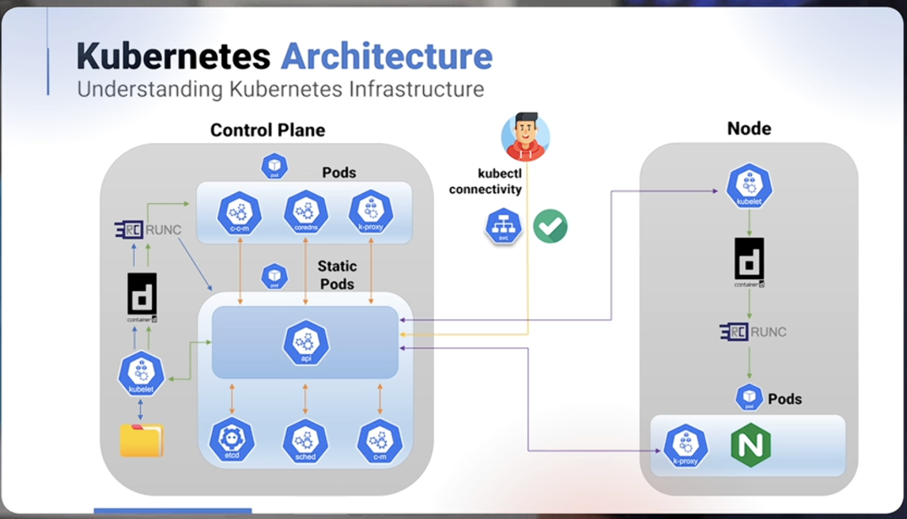

# 🧠 Kubernetes Architecture

## High-level Overview

Kubernetes is split into **two main parts**:

### Control Plane
- Manages the cluster
- Makes scheduling and control decisions
- Stores cluster state

### Nodes (Worker Nodes)
- Run application workloads
- Host Pods and containers

---

## 🧱 Container Runtime Stack

### Low-level Container Runtime
- Responsible for **creating and running containers**
- Interacts directly with Linux kernel features:
  - **Namespaces** (process isolation)
  - **cgroups** (resource limits)
- `runc`:
  - Reference implementation of an OCI-compatible runtime
  - Executes containers based on OCI specifications
- Usually installed **as part of a higher-level runtime**, not standalone

---

### High-level Container Runtime (Container Engine)
- Example: `containerd`
- Responsibilities:
  - Pulls container images
  - Stores images locally
  - Manages container lifecycle (start/stop/restart)
- Communicates with Kubernetes via the **CRI (Container Runtime Interface)**
- Delegates container execution to `runc`

---

## 🤖 Kubelet

- Agent that runs on **every node** (including control plane nodes)
- Maintains the state of Pods - Ensures Pods are **running and healthy** 
- Works using a **PodSpec** (YAML or JSON)

### How kubelet receives Pod specs
1. From the **API Server** (normal workloads)
2. From **local manifest files** (Static Pods)

Static Pod manifest location:
```bash
/etc/kubernetes/manifests
```

## 🎛️ Control Plane Core Components

### 📦 etcd
- Distributed key-value store
- Source of truth for the cluster
- Stores:
    - Cluster state
    - Configuration data
    - Secrets
- Handles:
    - Leader election
    - Network partitions
    - Node failures


## Production best practice
- Run an **odd number** of members
- Typically **3 or 5 nodes** 

## 🌐 kube-apiserver
- **Central entry point** for the cluster
- All components communicate **through it**
- Exposes as **RESTful API**
- Validates and processes requests
- Persists all state into **etcd**
- Communicates with kubelete via API

📌 Think of it as:

“The front door of Kubernetes”


## 🌐 kube-scheduler
- Control plane component
- Runs a **Static Pod**
- Decides **which node** a Pod should run on
- Considers:
    - CPU and memory availability
    - Node selectors
    - Affinity / anti-affinity rules
    - Taints and tolerations

Scheduler selects placement only - it does **not** create Pods

---

### 🔁 Controller Manager
- Runs **control loops**
- Continuously reconciles desired state vs actual state

Common controllers:
- Deployment controller - manages Deployments
- ReplicaSet controller - maintains replica count
- Node controller - monitors node health
- Job controller - manage batch jobs

Mental model:
"If something drifts, controllers fix it"

### ☁️ Cloud Controller Manager

- Present mainly in *public cloud Kubernetes**
- Integrates Kubernetes with cloud provider APIs

Handles:
- Load balancers
- Routes
- Node lifecyclue
- Cloud-specific resources

Examples:
- AWS ELB
- Azure Load Balancer
- GCP networking

---

# Networking Components


### 🔀 kube-proxy

- Runs as a DaemonSet (one per node)
- Not a static Pod
- Responsibilities:
    - Implements **Service networking**
    - Programs iptables / IPVS rules
    - Enables:
        - ClusterIP
        - NodePort
        - LoadBalancer traffic

Protocols supported:
- TCP
- UDP
- SCTP


### 🧭 CoreDNS
- Runs as a **Deployment**
- Provides **internal DNS**
- Enables service discovery:

```sh
my-service.my-namespace.svc.cluster.local
```

- Depends on Kubernetes controllers and API server


## 🔌 Container Network Interface (CNI)

Responsible for setting up networking so that Pods can communicate with each other across different nodes in the cluster. 

- A standard contract, not an implementation
- Between:
    - Container runtime
    - Network plugin

When a Pod is created, CNI plugin:
- Adds a network interface
- Assigns an IP address
- Sets up routing across nodes
- Applies network policy (if supported)


